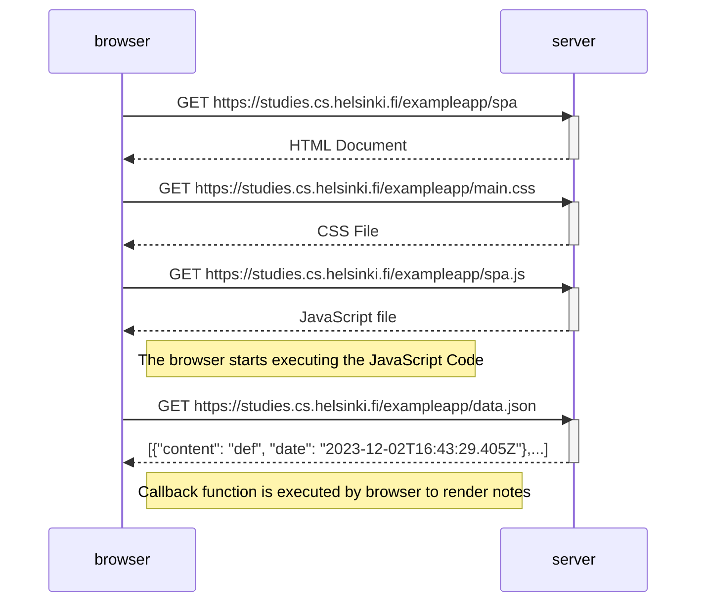

```mermaid
sequenceDiagram
    participant browser
    participant server

    browser ->> server: GET https://studies.cs.helsinki.fi/exampleapp/spa
    activate server
    server -->> browser: HTML Document
    deactivate server

    browser ->> server: GET https://studies.cs.helsinki.fi/exampleapp/main.css
    activate server
    server -->> browser: CSS File
    deactivate server

    browser ->> server: GET https://studies.cs.helsinki.fi/exampleapp/spa.js
    activate server
    server -->> browser: JavaScript file
    deactivate server

    Note right of browser: The browser starts executing the JavaScript Code 

    browser->>server: GET https://studies.cs.helsinki.fi/exampleapp/data.json
    activate server
    server -->> browser: [{"content": "def", "date": "2023-12-02T16:43:29.405Z"},...]
    deactivate server

    Note right of browser: Callback function is executed by browser to render notes
```